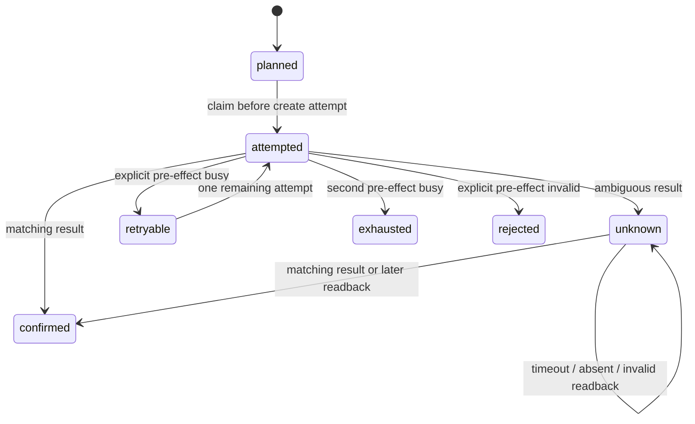

# When a timeout does not mean failure

**Synthetic/local workflow reliability case study. Not client work, a production
deployment, or a tested n8n/Make/Zapier integration.** All requests, tickets and
provider responses are invented. AI-assisted preparation; runnable acceptance
tests are included so you can inspect the behavior yourself.

A workflow receives an order event and creates a dispatch ticket. If the provider
creates the ticket but its response is lost, retrying the whole workflow can
create a second dispatch. This small example demonstrates how to stop at that
uncertainty boundary and reconcile later without another create request.

## Try it locally

Use Node.js 22 or later (validated here on 24.19.0). No install, package manager,
environment variables, network, credentials or external services are needed.
From this directory, including an exported copy containing only the manifest files:

```sh
node --test workflow.test.mjs
node demo.mjs
```

The demo prints six deterministic scenarios and their state histories. In
`lostResponse`, expect `first: unknown`, `duplicate: unknown`, `later: confirmed`,
`createCalls: 1`, `sideEffects: 1`. In `unresolved`, all three states stay `unknown`
and there are zero effects. A later absent lookup cannot distinguish delayed
visibility from a request that never completed, so it never permits a retry.

## Workflow and side-effect map

| Boundary | Input / output | Side effect / evidence |
|---|---|---|
| Receive event | Synthetic key, item, quantity | None; validate exact schema |
| Claim intent | Key bound to immutable payload | In-memory local record before awaiting provider |
| Create ticket | Bound request -> provider result | The only simulated external write |
| Classify result | Exact confirmation, proven pre-effect failure, or unknown | Update local history; never infer completion from an attempt |
| Reconcile | Same key -> exact provider readback | Read-only; no ticket creation |



Duplicate delivery returns the current record in every state. It does not reset
the attempt budget. Same key with different content is a conflict. A different
legitimate key can proceed. `confirmed` means only that this fictional provider
reports the matching ticket; it does not mean shipment, delivery or customer
acceptance. `planned` is intent, `attempted` is an in-flight call, and `attempts`
counts calls. Reconciliation waits until the call returns or throws. Promised/received
money states are deliberately absent: this is not financial evidence.

## Audit findings -> prioritized remediation -> acceptance

This is an audit of the invented workflow, with a small executable remediation
model. It makes no claim about a real customer's failure rate or savings.

| Priority / finding | Concrete remediation | Runnable checks |
|---|---|---|
| P0: lost response can cause duplicate dispatch | Record attempt before dispatch; block duplicates; exact readback only | A7, A8, A9, A13 |
| P0: overlapping deliveries can both pass a dedupe check | Claim by stable action key before the async boundary | A1, A2 |
| P0: key reuse can hide changed intent | Bind key to exact payload at workflow and provider | A3, A10 |
| P1: blanket retries repeat permanent failures or run forever | Only proven pre-effect busy retries; two total attempts; permanent rejection stops | A4, A5, A6 |
| P1: overly broad dedupe drops real work | Distinct action keys remain independent | A11 |
| P1: mutable outputs or malformed input corrupt tracking | Validate before dispatch; return isolated snapshots | A12 |

Each A-number is a named executable test in `workflow.test.mjs`, with concrete
call/effect/state assertions. The lost-response test checks that a ticket really
exists in the simulator before readback; it does not merely mock a success label.
The history preserves the earlier uncertainty after reconciliation.

## Contract assumptions and limits

- This is an in-memory, single-process teaching model. Its claim is synchronous
  within one Workflow instance. State disappears when the process exits. It does
  not demonstrate crash recovery, durable storage or cross-worker exclusion.
- The synthetic provider models atomic key/payload binding and exact readback.
  Those are explicit assumptions, not asserted features of a real provider.
  A real audit must verify key scope/retention, readback consistency and identity.
- Only the simulator's explicit `not-applied` result proves a pre-effect failure.
  HTTP status codes and generic exceptions alone do not. Unknown errors stop.
- The one allowed retry is immediate for deterministic local demonstration.
  Real scheduling needs bounded delays/backoff and persisted budgets. There is
  no timer, polling loop, automatic unknown-state recovery or manual override.
- Before adapting this pattern to production, scope durable atomic claims,
  write-before-call recovery, multi-worker races, provider timeouts and exact
  reconciliation separately. A hung call stays `attempted`; no live transport is
  implemented here. In-flight calls block duplicates and readback; unknown results
  block duplicates but allow readback. No universal exactly-once or zero-failure
  guarantee is made.

## What a bounded service audit delivers

For one agreed workflow: an input/output and side-effect map, identified unsafe
retry/duplicate/unknown-result boundaries, prioritized remediation, and at least
five concrete acceptance-test designs. Start from a redacted export, diagram or
synthetic examples. Implementation and deployment require separate scope.

This standalone proof illustrates that deliverable; it is not a finished product
or a claim of production platform experience. See [PUBLIC_EXPORT.md](PUBLIC_EXPORT.md)
for the exact files suitable for a later public portfolio export.
